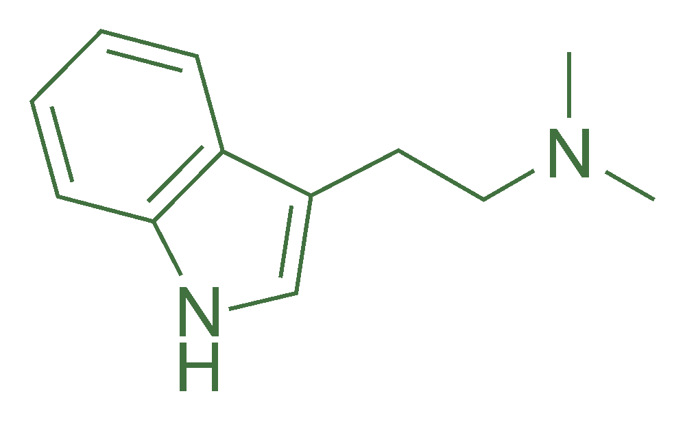

# GoDMT

[](https://goreportcard.com/report/github.com/averageflow/godmt)
[](https://pkg.go.dev/github.com/averageflow/godmt)
[](https://codeclimate.com/github/averageflow/godmt/maintainability)
[](https://codecov.io/gh/averageflow/godmt)
[](#)
[](https://github.com/averageflow/godmt/blob/master/LICENSE.md)

GoDMT, the one and only Go Data Model Translator. The goal of this project is to provide a tool that can parse Go files that include `var`, `const`, `map`, `struct` and `type` into an abstract syntax tree, aka AST.

<p align="center">
  
</p>

That AST will then be transformed into data models for several programming languages. Some small adjustments may need to be made to integrate the output into a project, but this should already save you a lot of time and hassle, and will help you stay in sync with the Go version of your data models, in other languages.

Comments will be carried over :)

Currently, the only supported operating systems are Linux, BSD and macOS.


## Usage

```
go run main.go -dir={scanDirectory} -translation={language} -preserve -tree
```

- `scanDirectory` represents a string that is the relative path of the directory whose Go files you want to scan. The scan occurs in a recursive manner, so all files from all contained folders will be scanned.
- `language` represents the output mode. If the `-translation` flag is not specified it will default to JSON. Currently supported options are:
    - `ts` or `typescript` for TypeScript conversion
    - `swift` for Swift conversion
    - `json` for JSON conversion
- `preserve` is an optional boolean flag which will make the output structs preserve the original names, instead of using the (`json:"tag"`).
- `tree` is an optional boolean that when present will prevent any file operations being performed, and instead will show you the full abstract syntax tree of your files in the standard output.

Example usage:

```
go run main.go -dir=../../tests/data/ -translation=ts
```

After a successful run, the program will output a `result.*` file in the current working directory.

## Talk is cheap, show code

Feel free to browse some [examples that I am happy to provide here](examples/Conversions.md).

## Building

To build this application as a binary simply navigate to `cmd/godmt` and run `go build`.